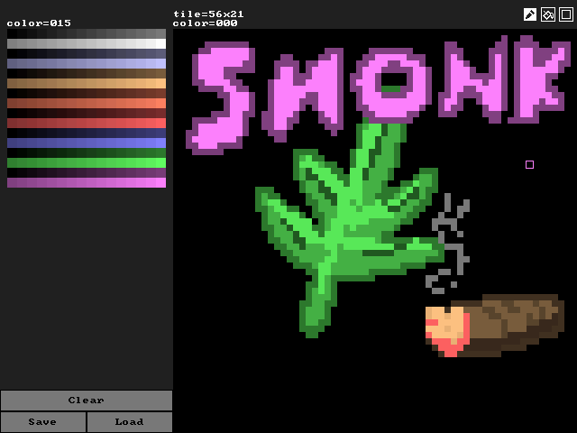

# EUI

EUI is a small UI and drawing library designed for homebrew games, debug UIs, embedded systems, and low resolution or low color depth displays.

The main EUI library is only two files, [`eui.c`](./source/eui.c) and [`eui.h`](./source/eui.h). To add EUI to your project, just clone the files into your source tree and compile.

While CMake is used to build the test and example programs, it is not required for EUI itself.

> [!WARNING]
> EUI is *not* yet production-ready, and the API is still changing. Proceed with caution.

## Configuration Switches

- `EUI_PIXEL_DEPTH`: Set target pixel depth in bits. Valid values: 1, 2, 4, 8, 16, 32. (Required!)

## Source Code Guide

### Main Files

- [`eui.c`](./source/eui.c) & [`eui.h`](./source/eui.h): Main platform agnostic EUI library.
- [`eui_sdl2.c`](./source/eui_sdl2.c) & [`eui_sdl2.h`](./source/eui_sdl2.h): Helper functions for integration with SDL2.

### Examples

- [`editor.c`](./source/examples/editor.c): Small image editor with the SDL2 backend.

### Tests

- [`4colors.c`](./source/tests/4colors.c): Render a single frame with a button (2bpp).
- [`basic.c`](./source/tests/basic.c): Render a single frame with a button.
- [`dos32.c`](./source/tests/dos32.c): Handle a button and mouse input on MS-DOS.
- [`sdl2_01.c`](./source/tests/sdl2_01.c): Handle a button and mouse input on SDL2.
- [`sdl2_02.c`](./source/tests/sdl2_02.c): Borderless window with button.
- [`sdl2_03.c`](./source/tests/sdl2_02.c): SDL2 1bpp test.
- [`sdl2_04.c`](./source/tests/sdl2_02.c): SDL2 4bpp test.

## Tested Compilers & Platforms

- GCC (Linux, Windows, DOS16, DOS32)
- Clang (Linux)
- Watcom (DOS16, DOS32)
- TCC (Linux)

## Todo

- Optimize font, pixel, and horizontal line functions
- Optimize sgn() macro
- Support DOS ANSI buffers
- Abstract SDL2 and DOS backends and make tests/examples modular

## Credits

- [SUI](https://github.com/shpuld/sui-qc/) (License: MIT)
- [font8x8](https://github.com/dhepper/font8x8/) (License: Public Domain)
- [Danelaw](https://thingvellir.net/git/danelaw/) (License: CC0 1.0)
- [SDL2 CMake modules](https://github.com/aminosbh/sdl2-cmake-modules) (License: BSD-3)
- [tiny file dialogs](https://sourceforge.net/projects/tinyfiledialogs/) (License: zlib)

## License

MIT License

Copyright (c) 2023 erysdren (it/she/they)

Permission is hereby granted, free of charge, to any person obtaining a copy
of this software and associated documentation files (the "Software"), to deal
in the Software without restriction, including without limitation the rights
to use, copy, modify, merge, publish, distribute, sublicense, and/or sell
copies of the Software, and to permit persons to whom the Software is
furnished to do so, subject to the following conditions:

The above copyright notice and this permission notice shall be included in all
copies or substantial portions of the Software.

THE SOFTWARE IS PROVIDED "AS IS", WITHOUT WARRANTY OF ANY KIND, EXPRESS OR
IMPLIED, INCLUDING BUT NOT LIMITED TO THE WARRANTIES OF MERCHANTABILITY,
FITNESS FOR A PARTICULAR PURPOSE AND NONINFRINGEMENT. IN NO EVENT SHALL THE
AUTHORS OR COPYRIGHT HOLDERS BE LIABLE FOR ANY CLAIM, DAMAGES OR OTHER
LIABILITY, WHETHER IN AN ACTION OF CONTRACT, TORT OR OTHERWISE, ARISING FROM,
OUT OF OR IN CONNECTION WITH THE SOFTWARE OR THE USE OR OTHER DEALINGS IN THE
SOFTWARE.
