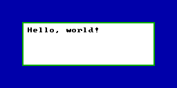

# EUI

EUI is a small UI and drawing library designed for homebrew games, debug UIs, embedded systems, and low resolution or low color depth displays.

The base EUI library is only two files, [`eui.c`](./source/eui/eui.c) and [`eui.h`](./source/eui/eui.h). To add EUI to your project, just clone the files into your source tree and compile.

While CMake is used to build the test and example programs, it is not required for EUI itself.

## Features

- Nested frames with relative element positioning and alignment.
- Automatic text justification.
- Automatic shape clipping.
- Built-in 8x8 pixel font.
- Integer math only.
- Draws into a raw pixel buffer by default.
- Supports 1, 2, 4, 8, 16, and 32 bits-per-pixel drawing.
- No dynamic memory allocation.

## Todo

- Write full API documentation outside of the header.
- Re-add previously removed code as optional modules (widgets, shapes, bitmaps).
- Support segmented memory model with appropriately placed FAR pointers.
- Support VGA text mode with alternative glyph drawing routines.
- See about making the Z-index baked into frames and draw commands.

## Usage

Here is a basic EUI usage example that assumes 4 bit color and the default 16 color VGA palette.

```c
/* set alignment to the center of the frame */
eui_frame_align_set(EUI_ALIGN_MIDDLE, EUI_ALIGN_MIDDLE);

/* draw 192x64 box and draw a 2px border */
eui_draw_box(0, 0, 192, 64, 0x0F);
eui_draw_box_border(0, 0, 192, 64, 2, 0x02);

/* create child frame with 8 pixels of padding on each side */
eui_frame_push(0, 0, 176, 48);

/* set child frame alignment to top-left */
eui_frame_align_set(EUI_ALIGN_START, EUI_ALIGN_START);

/* draw a string with the default 8x8 font */
eui_draw_text(0, 0, 0x00, "Hello, world!");

/* destroy child frame */
eui_frame_pop();
```



## Configuration Switches

- `EUI_MAX_FRAMES`: Maximum number of nested frames. Default: `128`
- `EUI_MAX_DRAWCMDS`: Maximum number of queueable draw commands. Default: `1024`

## Source Code Guide

### Modules

- [`eui.c`](./source/eui/eui.c) & [`eui.h`](./source/eui/eui.h): Base drawing primitives library.

### Examples

- [`hello.c`](./source/examples/hello.c): "Hello, World!".
- [`harness_dos.c`](./source/examples/harness_dos.c): MS-DOS implementation and example harness.
- [`harness_sdl2.c`](./source/examples/harness_sdl2.c): SDL2 implementation and example harness.

## Tested Compilers & Platforms

- GCC (Linux, Windows, DOS16, DOS32)
- Clang (Linux)
- Watcom (DOS16, DOS32)
- TCC (Linux)

## Credits

- [SUI](https://github.com/shpuld/sui-qc/) (License: MIT)
- [font8x8](https://github.com/dhepper/font8x8/) (License: Public Domain)
- [Danelaw](https://thingvellir.net/git/danelaw/) (License: CC0 1.0)
- [SDL2 CMake modules](https://github.com/aminosbh/sdl2-cmake-modules) (License: BSD-3)

## License

MIT License

Copyright (c) 2023 erysdren (it/she/they)

Permission is hereby granted, free of charge, to any person obtaining a copy
of this software and associated documentation files (the "Software"), to deal
in the Software without restriction, including without limitation the rights
to use, copy, modify, merge, publish, distribute, sublicense, and/or sell
copies of the Software, and to permit persons to whom the Software is
furnished to do so, subject to the following conditions:

The above copyright notice and this permission notice shall be included in all
copies or substantial portions of the Software.

THE SOFTWARE IS PROVIDED "AS IS", WITHOUT WARRANTY OF ANY KIND, EXPRESS OR
IMPLIED, INCLUDING BUT NOT LIMITED TO THE WARRANTIES OF MERCHANTABILITY,
FITNESS FOR A PARTICULAR PURPOSE AND NONINFRINGEMENT. IN NO EVENT SHALL THE
AUTHORS OR COPYRIGHT HOLDERS BE LIABLE FOR ANY CLAIM, DAMAGES OR OTHER
LIABILITY, WHETHER IN AN ACTION OF CONTRACT, TORT OR OTHERWISE, ARISING FROM,
OUT OF OR IN CONNECTION WITH THE SOFTWARE OR THE USE OR OTHER DEALINGS IN THE
SOFTWARE.
